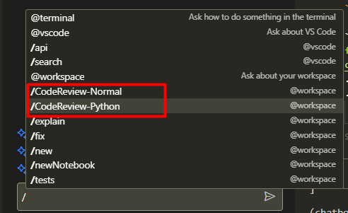

TLDR: I modified the `github copilot chat` extension's source code to dynamically include custom commands from `./Prompts` folder.

> [!WARNING]
> Modifications to the extension's source code is not recommended, when the extension is updated, the changes will be lost.
> This is just a quick productivity booster i figured out in a day. for a permanent and scalable solution see [Extending Github Copilot](https://youtu.be/RXaLlCeaBIA?si=zpLlAtMjnBbfg5vT)

## Motive
I wanted to leverage AI in day-to-day tasks, Github Copilot is a great tool to assist in coding. Apart from coding, there are other common tasks like code review, research, etc. these things needs custom prompts to be included in the chat every time. So I thought to include custom commands in the Github Copilot Chat which will make things easier.

## Custom Commands in Github Copilot Chat
Github Copilot Chat extension in VSCode is a closed source project, their code is not publicly available. However the minified version of client side code of any installed extension will be in path `C:\Users\<username>\.vscode\extensions\<extension-name>\dist\extension.js`. The extension.js file is minified, so it is difficult to understand the code. But there is a [blog post](https://thakkarparth007.github.io/copilot-explorer/posts/copilot-internals.html) that explains the internals of the extension.

I wrote a code snippet that can be used to dynamically include custom commands from `./Prompts` folder. 

After including the custom commands, the chat will look like this:


To include custom commands:
Copy the below code snippet to the `extension.js` file in the `github copilot chat` extension folder.

> [!WARNING]
> I am using copilot-chat version `0.11.1`, when you are reading this, the extension.js file might have been updated, so the minified global function names in the below code snippet like `Ds`, `_f`, `Q7`, `w9e`,`ws`, `Sn` might not work.

```js
fetch("https://api.github.com/repos/vignesh14052002/KnowledgeBase/contents/knowledge_base/AI/GithubCopilot/Prompts")
.then((res)=>res.json())
.then((data)=>{
    let commands = [];
    let promises = data.map(file => 
        fetch(file.download_url)
        .then((res)=>res.text())
        .then((data)=>{
            let regex = /## (.*?)\n```txt\n(.*?)\n```/gs;
            let match;
            while ((match = regex.exec(data)) !== null) {
                const command = file.name.split(".")[0];
                commands.push({
                    "command": `${command}-${match[1]}`,
                    "prompt": match[2]
                });
            }
        })
    );
    Promise.all(promises).then(() => commands.map((command)=>{
        registerCustomCommand(command);
    }));
});

function registerCustomCommand(command) {
    function commandFunction() {
        let t = new Ds({
        location: 2,
        id: command.command,
        description: Q7.t("Review the Code"),
        modelDescription:
            "Reviews the given code.",
        modelSampleQuestion:
            "review the provided code",
        commandInfo: {
            allowsEmptyArgs: !0,
        },
        systemPromptOptions: {
            skipDefaultPrompt: !0,
            roleplay: command.prompt,
        },
        rules: w9e,
        
        responseProcessor: (e, r, n) => new X7(e, r, n),
        contextResolvers: [ws],
        });
        Sn.registerIntent(t);
    }
    If.workspace.push(command.command);
    _f.registerContribution(commandFunction);
}
```

Additionally, I don't want the default prompt to be included in the custom commands, so I added a condition to skip the default prompt. but this is step is optional, in my entension file the function is mentioned as `yy`
```js

async function yy(
    t,
    e,
    r,
    n = { includeCodeGenerationRules: !0, includeCapabilities: !1, skipDefaultPrompt: !1 },
  ) {
    if (n.skipDefaultPrompt){return n.roleplay;}
    // other code
}
```