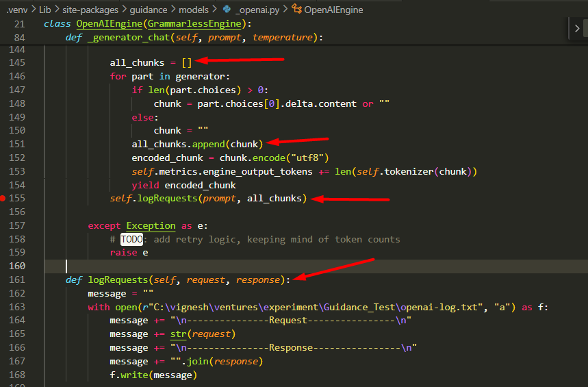

For stream completion, collect the response from where the generator is getting used
Example : guidance framework

```python
def logRequests(self, request, response): 
    message = "" 
    with open(r"C:\vignesh\ventures\experiment\Guidance_Test\openai-log.txt", "a") as f: 
        message += "\n---------------Request----------------\n" 
        message += str(request)
        message += "\n---------------Response----------------\n" 
        message += "".join(response) 
        f.write(message)
```