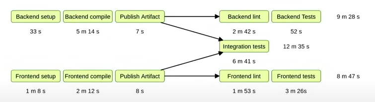

# Automation in microservice AI app development 

## Development Workflow
- Vscode tasks
    - Start multiple services at a time 
    - Validate .env and .env.example are in sync 
    - Build whl files and install them in dependent services

## Testing Workflow
- With AI
    - Performance Evaluation system 
    - Automated Trigger of end to end workflow, with manual evaluation of results 
- AI mocked 
    - Unit : tests each service
        - Runs on PR: when the service code changes
        - [Python Testing Readme](./TestingReadme.md)
    - Integration : tests integration between two service
        - Runs on PR: when any of the test dependent service code changes
        - Runs on integration test environment, (seperate azure queues) 
    - End to End : test from frontend
        - Runs on PR: when any of the test dependent service code changes (or periodically on main branch)
        - Uses mock server from all services (mock server creation is as simple as importing test mocks and start the server) 

## Pipelines
- Flaky test identification - run failed tests again and if it passed, mark as flaky
    - [Reference : NDC Oslo 2024 : Developer Joy](https://youtu.be/zqjyPl5ytZc?si=yqXffh1REQGaWftG)
- Optimizing pipelines
    - [Reference: NDC Oslo 2024 : CI/CD patterns and antipatterns](https://youtu.be/OonABHdHD2I?si=n7iu7bQf3M-8l_2v)
    - Run independent pipelines parallelly and sequence them for quick feedback and optimized execution
        
